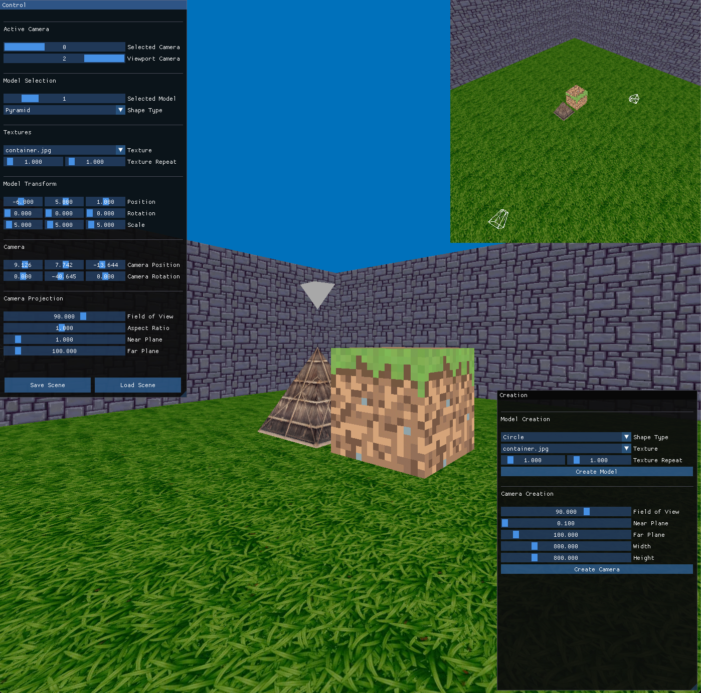
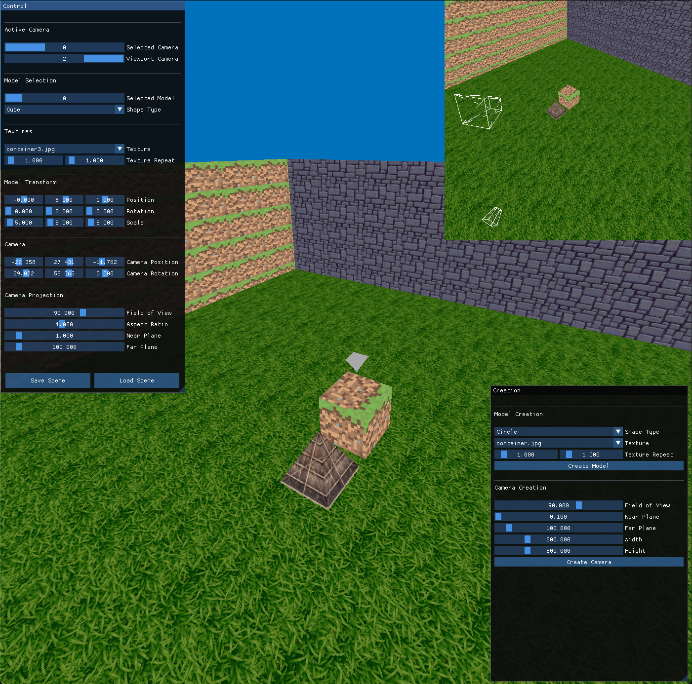

## Computer Graphics Course Assignment

Developed & tested on MacOs Sonoma, use `run.sh` to run it.

- Libraries used: OpenGL, GLFW, GLM, GLAD
- Model selection & transformations
- Multiple cameras and dynamic transformations
- Ability to save & load scenes
- Customizable viewport to display other camera views.
- Model creation
	- Shape
	- Texture
- Camera Creation
	- FOV, near, far, width, height

## Images

